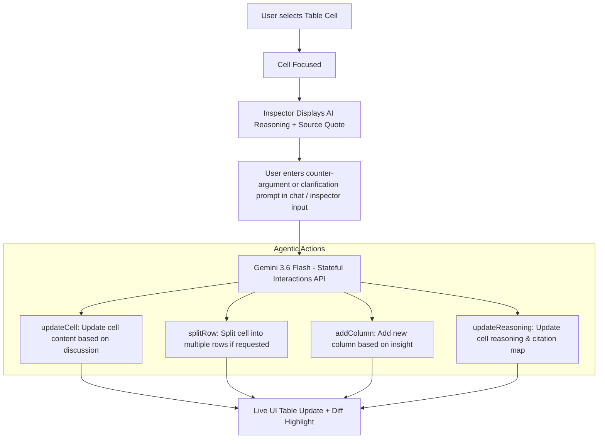

# Implementation Plan - Cell Evidence Inspector & Agentic Follow-Up Engine

This plan extends the **Cell Evidence & AI Reasoning Inspector** to support **interactive follow-up conversations** and **agentic table mutations** directly from the inspector card.

---

## 1. Interactive Follow-up & Agentic Mutation Flow



---

## 2. Key Scenarios & Capabilities

### Scenario A: Counter-Argument & Cell Content Update
1. User inspects cell `Methodology` (*"Bacteriophage isolation & Disc Diffusion Method"*).
2. User types in chat: *"Actually, on page 2 they also used genomic sequencing as the primary method."*
3. **Agent Action**:
   - Gemini validates the counter-argument against `38094623.pdf`.
   - Executes `update_cell_data(rowId, "methodology", "Bacteriophage isolation, Disc Diffusion & Genomic Sequencing")`.
   - Updates the cell reasoning: *"Updated methodology based on user clarification and Page 2 sequencing protocols."*

### Scenario B: Restructuring Rows & Columns
1. User says: *"Split this methodology into two distinct rows for phage Sfln-2 and Sfln-6."*
2. **Agent Action**:
   - Executes `split_selected_row(rowId, "methodology")`.
   - Restructures the table into 2 dedicated rows and highlights them for user approval.

---

## 3. Architecture Extensions

### A. Extended Cell Citation Store (`src/types/grid.ts`)
```typescript
export interface CellCitation {
  pageNumber: number;
  sectionName: string; // "Section 2.1 - Phage Isolation"
  snippetQuote: string; // Quoted text passage
  reasoning: string;    // Model explanation
  confidence: number;   // 0.95
  bbox?: { x: number; y: number; width: number; height: number };
  history?: Array<{ sender: 'user' | 'agent'; text: string; timestamp: string }>; // Conversation thread for this cell
}
```

### B. Interactive Inspector Card (`src/components/agent/RightAgentPanel.tsx`)
- Displays:
  - 📍 **Source Location & Page**
  - 💡 **Model Reasoning**
  - 💬 **Evidence Passage**
  - 💬 **"Discuss / Clarify" Input Box**: Allows typing follow-ups directly focused on the selected cell!
  - ⚡ **Quick Action Buttons**: `[✏️ Update Cell]` `[✂️ Split into Rows]` `[✓ Confirm Cell]`

---

## 4. Implementation Steps

1. **`src/types/grid.ts`**: Update `CellCitation` & `GridRow` with rich citation metadata and reasoning history.
2. **`src/store/useGridStore.ts`**: Add citations map to initial sample rows and expose `updateCellCitation(rowId, field, citation)`.
3. **`src/components/agent/RightAgentPanel.tsx`**: Implement the **Cell Evidence & Reasoning Inspector** tab with inline follow-up input and quick agentic action buttons.
4. **`src/components/pdf-viewer/PdfReader.tsx`**: Scroll to target page and draw evidence bounding box with section labels.

---

## Verification Plan

### Automated Tests
- `npm run build`: Verify clean TypeScript compilation.
- `npm test`: Verify Vitest test suite.

### Manual Verification
- Click cell `Methodology` $\rightarrow$ Inspector card shows section quote & model reasoning.
- Type *"Add genomic sequencing to this methodology"* in the inspector input $\rightarrow$ Agent updates the cell content, updates the reasoning, and highlights the row in yellow.
- Click `[✂️ Split into Rows]` $\rightarrow$ Agent splits the row into 2 separate phage rows.
