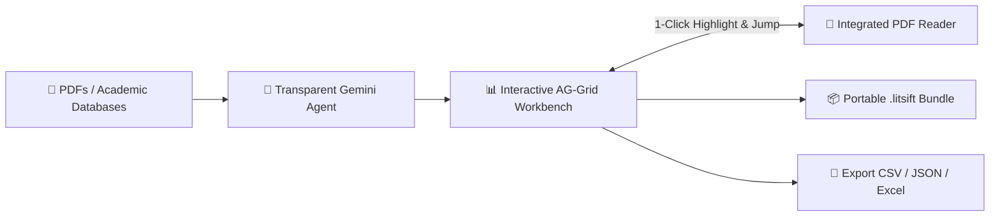

# 🔬 LitSift Cloud

> **The Transparent, Human-in-the-Loop Research Extraction Workspace.**  
> Transform hundreds of scientific papers (from local PDFs or online academic databases) into auditable, structured datasets in days — not months.

[](https://litsift.onrender.com)
[](https://aistudio.google.com/)
[](https://dexie.org/)
[](#-key-features)
[](https://react.dev/)
[](https://www.typescriptlang.org/)
[](https://vitejs.dev/)
[](https://deepmind.google/technologies/gemini/)
[](#-license)

---

## 🌐 Try the Live Web App (No Setup Required)

You don't need to install anything to evaluate or use LitSift:

👉 **[Launch LitSift Cloud on Render](https://litsift.onrender.com)**

Bring your Google Gemini API key to start extracting research data directly in your browser.

---

## 🎯 The Origin Story: Why LitSift?

Systematic literature reviews and meta-analyses are among the most valuable assets in scientific research — yet synthesizing hundreds of papers remains painfully manual.

> **The Reality:**  
> A junior researcher given 300 academic PDFs typically spends **months** manually reading each paper, copying data points into Excel line-by-line, and double-checking methodology. 
>
> Generic AI search engines act as **"black boxes"** — they hallucinate numbers, misquote sample sizes, and lack the rigorous auditability required for peer-reviewed research.

**LitSift provides the antidote:** an AI-powered extraction workbench that automates the repetitive, mechanical 90% of data extraction while keeping the researcher in full control of verification and synthesis. What once took **months can now be completed in days.**

---

## 💡 Why LitSift? (Open, Local-First, Paywall-Free)

While powerful commercial platforms like Elicit provide robust PDF extraction, they are closed SaaS products bound to strict monthly credit quotas, remote server storage, and expensive institutional plans.

**LitSift brings systematic research extraction into an open-access, local-first, and zero-cost workspace.**

| Dimension | Commercial SaaS (e.g. Elicit) | LitSift Cloud Workspace |
| :--- | :--- | :--- |
| **Core Workflow** | Custom column PDF extraction table | **Custom column PDF extraction table** |
| **Pricing & Access** | $30–$50+/mo subscription & credit limits | **100% Free & BYOK** (Pennies on direct Gemini API) |
| **Data Privacy & Storage** | Uploaded to remote vendor cloud servers | **100% Local-First** (Stored in your browser's Dexie / IndexedDB) |
| **Project Portability** | Closed SaaS workspace lock-in | **Single-file `.litsift` bundle** (PDFs + grid + chat + highlights) |
| **Paper Ingestion** | Local PDF upload + Semantic Scholar index | **Batch PDFs + Direct JATS XML Ingestion** (PubMed Central, DOIs, OpenAlex, Crossref) |
| **Data Grid Engine** | Fixed web table view | **Full AG-Grid Workbench** (Spreadsheet sorting, resizing, formulas & CSV/JSON export) |

---

## ✨ Key Features



1. 🤖 **Transparent Agentic Extraction:**  
   Choose between autonomous autopilot or interactive human-in-the-loop mode. Define domain-specific schemas on the fly. Every cell records its chain-of-thought rationale and source excerpt.

2. 🎯 **Bi-Directional Evidence Highlighting:**  
   Click any cell in the AG-Grid to automatically jump the integrated reader to the exact page, sentence, and highlighted bounding box. Zero manual scanning across 50-page manuscripts.

3. 📦 **Portable Workspace Bundles (`.litsift`):**  
   Export your whole research state into a single `.litsift` bundle. Your supervisor or co-author can import it into LitSift and immediately resume your workflow with all PDFs, active grid cells, chat logs, and highlighted citation coordinates intact.

4. 🌐 **Multi-Source Ingestion (No Pre-Downloading):**  
   Drag and drop local PDF batches or fetch full-text articles directly via **DOIs, PubMed Central (PMC), OpenAlex, Crossref, and Unpaywall**.

5. 📊 **Enterprise-Grade Data Grid (AG-Grid):**  
   Full spreadsheet capability with inline editing, multi-column sorting, column grouping, filtering, and instant export to **CSV, JSON, and Markdown** for R, Python (Pandas), or Excel.

6. 🔒 **Local-First & Private:**  
   Workspace state is persisted locally in your browser via Dexie.js (IndexedDB). Your research files communicate directly with Google Gemini using your personal API key — no third-party intermediary servers.

---

## 🚀 Quickstart & Local Development

> 💡 **Prefer not to install anything?** Use the live app directly at **[LitSift.onrender.com](https://litsift.onrender.com)**.

If you want to run or develop LitSift locally:

### Prerequisites
- [Node.js](https://nodejs.org/) (v18.0.0 or higher)
- [npm](https://www.npmjs.com/) or [pnpm](https://pnpm.io/)
- A [Google Gemini API Key](https://aistudio.google.com/)

### 1. Clone the Repository
```bash
git clone https://github.com/discoveraniket/LitSift_cloud.git
cd LitSift_cloud
```

### 2. Install Dependencies & Start Server
```bash
npm install
npm run dev
```
Open your browser and visit `http://localhost:5173`.

### 3. Configure Your API Key
1. Open the **Settings** modal inside the LitSift UI.
2. Enter your **Google Gemini API Key**.
3. Choose your extraction model (e.g., `gemini-2.5-flash` or `gemini-2.5-pro`).

---

## 🛠️ Technology Stack

| Layer | Technologies |
| :--- | :--- |
| **Hosting & Deployment** | [Render](https://litsift.onrender.com) |
| **Frontend Framework** | [React 19](https://react.dev/), [TypeScript](https://www.typescriptlang.org/), [Vite](https://vitejs.dev/) |
| **Data Grid** | [AG-Grid Community](https://www.ag-grid.com/), [@tanstack/react-table](https://tanstack.com/table) |
| **PDF Processing & Highlighting** | [PDF.js](https://mozilla.github.io/pdf.js/) |
| **External Ingestion** | PMC, OpenAlex, Crossref & DOI APIs |
| **AI / LLM Integration** | [@google/genai SDK](https://www.npmjs.com/package/@google/genai) (Gemini 3.x) |
| **State Management** | [Zustand](https://github.com/pmndrs/zustand), [Immer](https://immerjs.github.io/immer/) |
| **Local Persistence** | [Dexie.js](https://dexie.org/) (IndexedDB Wrapper) |
| **UI & Drag/Drop** | [Lucide React](https://lucide.dev/), [Tailwind Merge](https://github.com/dcastil/tailwind-merge), [DND Kit](https://dndkit.com/) |

---

## 📖 Documentation Roadmap

- [x] **[Foundation & Philosophy](docs/Documentation_foundation.md)** — Architectural principles and Diátaxis framework.
- [ ] **User Guide (`docs/user/`)** — Step-by-step tutorials for building custom extraction schemas and batch reviewing.
- [ ] **Developer Guide (`docs/developer/`)** — Comprehensive architecture deep-dives, agent tool registry, and contribution rules.

---

## 👥 Author & Credits

* **[Aniket Sarkar](https://github.com/discoveraniket)** - Lead Software Architect & Developer.
* **Dr. Adhip Mukhopadhyay** - Co-Author & Virology Domain Specialist

Developed as part of the **[`asma (pip install asma)`](https://github.com/discoveraniket/asma)** systematic literature review ecosystem.

---

## 🤝 Contributing

Contributions from researchers, data scientists, and developers are welcome!

1. Fork the repository.
2. Create your feature branch (`git checkout -b feature/AmazingFeature`).
3. Commit your changes (`git commit -m 'Add some AmazingFeature'`).
4. Push to the branch (`git push origin feature/AmazingFeature`).
5. Open a Pull Request.

---

## 📄 License

Distributed under the MIT License. See `LICENSE` for more information.


