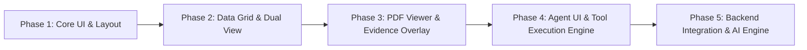

# LitSift Cloud - Phased Development Roadmap

This document outlines the step-by-step development strategy for **LitSift Cloud**. We follow a progressive enhancement strategy: **UI Foundation & Interaction Mocking first**, followed by state integration, PDF reader evidence overlays, and backend AI agent tool execution.

---

## Phase Overview

---

## Phase 1: Core UI Shell & Layout Scaffold (Current Focus)

**Goal**: Build a stunning, responsive, VS Code-style 4-pane resizable layout with modern dark/light design system tokens.

### Key Milestones:
1. **Scaffold Vite + React + TypeScript Project**:
   - Core libraries: `react-resizable-panels`, `lucide-react`, Vanilla CSS / Modern Tokens.
2. **4-Panel Resizable Workspace Component**:
   - **Left Panel**: Folder/File Tree Explorer skeleton, Master Table Tab switcher, Schema Manager.
   - **Central Panel**: Dual-mode container (PDF Viewer placeholder vs. Master Data Table tab).
   - **Right Panel**: Agentic AI Chat panel shell with action stream & prompt bar.
   - **Bottom Panel**: Collapsible/resizable Data Grid container with action toolbar.
3. **Design System & Aesthetics**:
   - Implement curated theme tokens (HSL color variables, glassmorphism, crisp typography, custom scrollbars, subtle hover transitions).

---

## Phase 2: Dual-View Data Grid & Mock Interactive State

**Goal**: Implement TanStack Table v8 with full dual-view capabilities, row operations, and visual pending AI edit highlights.

### Key Milestones:
1. **Zustand + Immer State Store**:
   - Store structure for `workspaceFiles`, `schemas`, `masterRows`, `pendingAIEdits`, `activeView`.
2. **Dual Data Grid Views**:
   - **Central Master Data View**: Displays all rows across all mock papers.
   - **Bottom Document-Scoped View**: Filters rows dynamically to match `activePdfId`.
3. **Interactive Grid Operations**:
   - Inline cell editing, row selection, row addition/deletion, row splitting/merging handlers.
   - Action Bar: `Extract Data`, `Merge Rows`, `Split Row`, `Accept AI Edits`, `Reject AI Edits`, `Export CSV`.
4. **AI Edit Highlighting & Diff Badges**:
   - Visual styling for pending AI changes (yellow/blue highlights with one-click Accept/Reject badges).

---

## Phase 3: PDF Viewer & Evidence Bounding-Box Layer

**Goal**: Render academic PDFs in the central panel with interactive text layers and bounding-box snippet highlights.

### Key Milestones:
1. **PDF Reader Engine (`react-pdf` / `pdfjs-dist`)**:
   - Page navigation, zoom controls, fit-to-width/height options.
2. **Visual Evidence Bounding-Box Overlay**:
   - Canvas/SVG highlight layer over PDF text passages.
3. **Bi-Directional Highlight Linking**:
   - Clicking a table cell highlights corresponding source passage on the PDF page.
   - Selecting PDF text allows manual linking to grid cells.

---

## Phase 4: Agent UI & Interactive Command Simulation

**Goal**: Build the rich agentic command center panel with natural language prompt execution, live tool execution logs, and interactive clarification modals.

### Key Milestones:
1. **Agent Chat UI**:
   - Message stream (user prompts, AI responses, tool invocation badges).
   - Interactive clarification cards (questions with selectable options).
2. **Mock Tool Execution Engine**:
   - Simulate prompts like *"split row 5 col 6"* or *"generate schema for methodology"* triggering real Zustand state mutations and pending AI highlights.

---

## Phase 5: Live AI Agent Backend & Tool Integration

**Goal**: Connect the agent UI and workspace tools to live LLM function calling APIs (Gemini 1.5 Pro / Flash).

### Key Milestones:
1. **Function Calling & Tool Declarations**:
   - Connect `generate_schema`, `propose_cell_edit`, `propose_split_cell`, `extract_schema_data`, `highlight_evidence` to LLM tool definitions.
2. **Document Chunking & Vector/Context Extraction**:
   - Preprocess PDF text and bounding-box coordinates for accurate schema extraction.
3. **CSV Export & Workspace Persistence**:
   - Export verified datasets to CSV / JSON and save workspace states.
