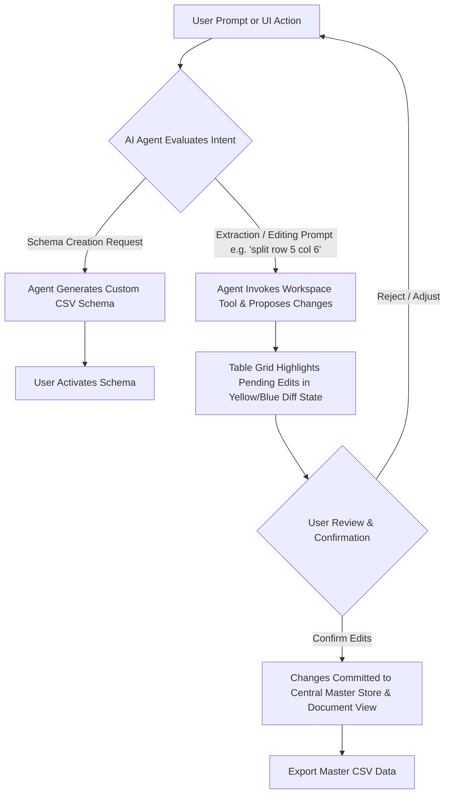

# LitSift Cloud - Project Specification & Technical Blueprint

## 1. Executive Overview & Core Vision
**LitSift Cloud** is an **agentic, human-in-the-loop research workspace** designed to extract, verify, and manipulate structured information from academic research papers (PDFs).

### Core Pillars:
1. **Agentic System Paradigm**: Everything can be driven by natural language prompts or UI controls. The AI Agent possesses full tool capabilities across workspace files, layout panels, schemas, data extractions, and table edits (e.g. *"extract methodology from this paper"*, *"generate a schema for sample sizes and key results"*, *"split row 5, col 6"*).
2. **Dual-View Data Grid**:
   - **Central Master Data View**: Displays the aggregated master table containing extracted data across **all PDFs** in the workspace when opened in the central panel.
   - **Bottom Document-Scoped View**: Displays **only the rows relevant to the currently opened PDF** for targeted review and evidence tracing.
3. **AI Change Highlighting & User Confirmation**: All AI-driven extractions, edits, row splits, or merges are visually highlighted in a *Pending Review* diff state until explicitly accepted or rejected by the user.
4. **Autonomous Schema Generation**: Users can describe extraction goals in plain text, and the AI Agent designs, structures, and proposes custom CSV schemas.

---

## 2. User Interface Blueprint (VS Code 4-Pane Workspace)

LitSift Cloud utilizes a modular, resizable 4-panel layout mirroring modern IDEs:

### Mode A: Document Focus Mode (Active PDF + Document-Scoped Table)
```
+------------------+----------------------------------+------------------------------+
|  LEFT PANEL      | CENTRAL PANEL                    | RIGHT PANEL                  |
|  (Explorer)      | (Active PDF Reader)              | (Agentic AI Command Center)  |
|                  |                                  |                              |
|  - Folder Tree   |  - Current PDF Document Viewer   |  - Natural Language Agent Chat|
|  - PDF Paper List|  - Bounding-Box Evidence Overlay |  - Interactive Clarifications|
|  - Schema Select |  - Text Selection & Page Controls|  - Live Tool Execution Logs  |
|  - Master Grid Tab|                                 |                              |
+------------------+----------------------------------+------------------------------+
|  BOTTOM PANEL (Document-Scoped Data Grid - Current PDF Only)                                |
|  - Displays ONLY extracted rows corresponding to the active PDF                            |
|  - Action Bar: Extract Data | Merge Rows | Split Row | Confirm AI Edits | Undo/Redo | Export|
+--------------------------------------------------------------------------------------------+
```

### Mode B: Workspace Master Grid Mode (Global Table Active)
```
+------------------+--------------------------------------------------+------------------------------+
|  LEFT PANEL      | CENTRAL PANEL                                    | RIGHT PANEL                  |
|  (Explorer)      | (Workspace Master Data Grid View)                | (Agentic AI Command Center)  |
|                  |                                                  |                              |
|  - Folder Tree   |  - MASTER TABLE containing all extracted data    |  - Workspace-wide Prompts    |
|  - Paper List    |    across ALL processed papers in the workspace  |  - Global Bulk Operations    |
|  - Active Tab:   |  - Bulk Filtering, Cross-Paper Merging, Export   |  - Schema & Tool Management  |
|    Master Table  |                                                  |                              |
+------------------+--------------------------------------------------+------------------------------+
|  BOTTOM PANEL (Collapsed or Contextual Details Panel)                                       |
+--------------------------------------------------------------------------------------------+
```

---

## 3. Comprehensive Tech Stack Specification

Below is the complete technology stack tailored for LitSift Cloud:

| Layer / Responsibility | Technology Choice | Detailed Rationale & Role |
| :--- | :--- | :--- |
| **Web Framework** | **Vite + React (TypeScript)** | Ultra-fast client build pipeline, ideal for complex client-side state, canvas overlays, and live AI streaming. |
| **Multi-Panel Layout** | **`react-resizable-panels`** | Native draggable splitters for the 4-panel layout, persistent pane sizing in `localStorage`, auto-collapse support. |
| **Data Grid Engine** | **TanStack Table v8 (React Table)** | Headless data grid powering both the **Central Master View** and **Bottom Document View**. Supports custom AI diff-highlight renderers and cell editing. |
| **PDF Viewer & Evidence Layer** | **`react-pdf` (`pdfjs-dist`)** | Renders PDF pages onto HTML5 canvas with a text layer. Custom SVG overlay draws clickable bounding-box evidence highlights linked to table cells. |
| **State Management & History** | **Zustand + Immer** | Single normalized state store for workspace data. `Immer` enables instant **Undo/Redo** history stacks for table mutations and AI action queues. |
| **Styling & Design System** | **Vanilla CSS + Lucide Icons + Radix UI** | VS Code dark/light design system with modern typography, glassmorphism, accessible tooltips, dialogs, and context menus. |
| **AI Agent & Tool System** | **Gemini 1.5 API (Function Calling)** | Powers the natural language command center with structured outputs, interactive clarification queries, and workspace tool execution. |

---

## 4. AI Agent Capabilities & Tool Registry

| Tool Category | Tool Signature | Functionality |
| :--- | :--- | :--- |
| **Schema Generation** | `generate_schema(prompt)` | Auto-designs CSV extraction schema from natural language goals. |
| **Extraction** | `extract_schema_data(pdf_ids, schema)` | Runs structured AI extractions with pending diff highlights. |
| **Grid Operations** | `propose_cell_edit(row, col, val)` | Proposes cell edits with visual confirmation highlighting. |
| **Grid Structure** | `propose_split_cell(row, col, criteria)` | Splits cells/rows (e.g. *"split row 5 col 6"*). |
| **Grid Structure** | `propose_merge_rows(row_indices)` | Merges selected rows in document or master view. |
| **User Approval** | `confirm_ai_changes(ids)` / `reject_ai_changes(ids)` | Batch approves or rejects pending AI changes. |
| **Navigation & View** | `switch_view(view_mode, target_id)` | Toggles Central Panel between Master Grid and PDF viewer. |
| **Evidence Link** | `highlight_evidence(pdf_id, snippet)` | Highlights exact source text passage in the active PDF. |

---

## 5. Functional Workflow

